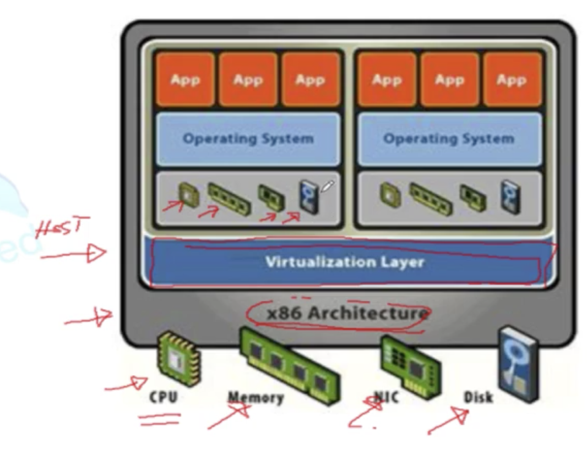
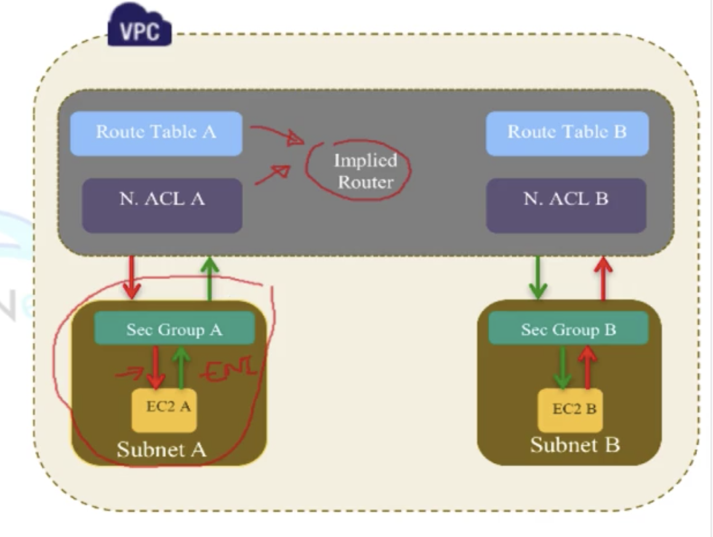
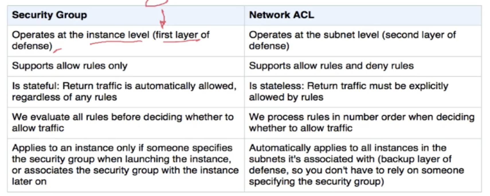
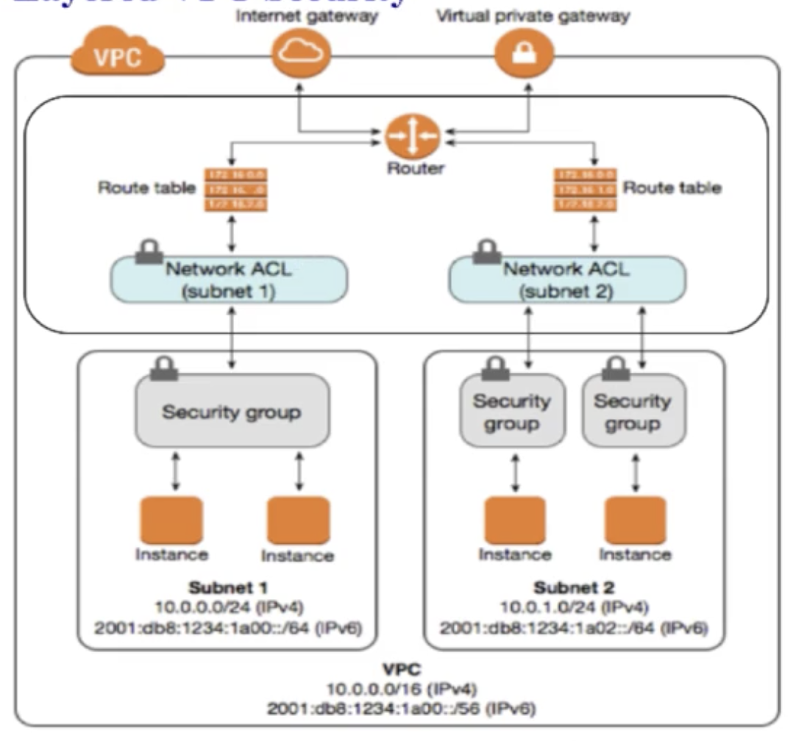

- [AWS Certified Solutions Architect - Associate Course](#aws-certified-solutions-architect---associate-course)
- [Introduction to cloud computing and aws global infrastructure](#introduction-to-cloud-computing-and-aws-global-infrastructure)
  - [On premise data center](#on-premise-data-center)
  - [Cloud computing](#cloud-computing)
    - [Cloud computing offerings](#cloud-computing-offerings)
    - [Cloud types](#cloud-types)
    - [Cloud vs on premise](#cloud-vs-on-premise)
- [Getting started in AWS](#getting-started-in-aws)
  - [IAM](#iam)
- [Virtual Private Cloud](#virtual-private-cloud)
  - [VPC Intro](#vpc-intro)
  - [Implied Router and Route Tables](#implied-router-and-route-tables)
    - [Implied Router](#implied-router)
    - [Route Tables](#route-tables)
  - [IP Addressing, internet gateway and subnet types](#ip-addressing-internet-gateway-and-subnet-types)
    - [IP Addressing](#ip-addressing)
    - [Internet gateway](#internet-gateway)
    - [Public subnets vs Private Subnets](#public-subnets-vs-private-subnets)
  - [VPC Demo 1 Overview lab](#vpc-demo-1-overview-lab)
  - [VPC Demo 2 Overview lab](#vpc-demo-2-overview-lab)
  - [VPC Types and Security Groups intro](#vpc-types-and-security-groups-intro)
    - [VPC types](#vpc-types)
    - [Security groups](#security-groups)
  - [DEMO 3 Creating a custom VPC](#demo-3-creating-a-custom-vpc)
  - [DEMO 4 Security Groups](#demo-4-security-groups)
  - [Security Groups Mastery](#security-groups-mastery)
    - [Default and non-default security groups](#default-and-non-default-security-groups)
  - [Network Access Control List (NACL)](#network-access-control-list-nacl)
  - [Network ACLs and Security Groups](#network-acls-and-security-groups)
  - [Network Address Translation (NAT)](#network-address-translation-nat)
    - [Resumed](#resumed)
    - [Security group configuration](#security-group-configuration)
    - [NAT Gateway](#nat-gateway)
  - [VPC Wizard](#vpc-wizard)
    - [Deleting a VPC with a NAT instance](#deleting-a-vpc-with-a-nat-instance)
  - [VPC Peering](#vpc-peering)
  - [AWS Transit getaway](#aws-transit-getaway)
  - [Virtual Private Networks](#virtual-private-networks)

# AWS Certified Solutions Architect - Associate Course

Amazon web service course for the exam of associate exam.

# Introduction to cloud computing and aws global infrastructure

## On premise data center

- Data center is a location where there is a lot of servers hosting the application and data.
- You can have multiple data centers to prevent down time
- Server can be divided virtually to host multiple apps in one server
- The problem is that they cost a lot.
- Components:
  - Netword
  - Security
  - Servers (compute)
  - WAN Wide are network to connect the servers
  - Internet
  - Storage
  - File Sharing
- **When you move to the cloud all this is taken care of by the cloud provider: AWS**
- Load Balancing
  - Distributes workload in the different computer resources
- DC Multi-Tenancy
  - Host multiple clients/users on the same infrastructure, so you virtualize the services.
- Servers
  - Physical -> physical computers
  - Virtual -> Same computer but divided into diferent vms
    - In AWS is cales EC2 (Elastic compute cloud)

## Cloud computing

- is the delivery of on-demand computing resources over the internet
- Sharing computing resources instead of having local servers
- internet based computing shared processing resources and data to computers and other devices on demand
- Advantages:
  - No setup fees
- Even though the computers are usually shared you can ask for a dedicated server

### Cloud computing offerings

- Infrastructure as a service (IaaS)
  - connectivity
  - security
  - You will install all, you will only rent the servers
- Platform as a service (PaaS)
  - It will give you the database but it wont handle it for you
- Database as a service (Daas)
  - Database is handled for you
- Software as a service
  - Like Office 365
  - They sell the software in the cloud and you don't need to worry about anything

### Cloud types

- Public cloud
  - Having the costumers have their own portal
  - Everyone can access it
- Private cloud
  - client build their own automated cloud by their own
- Hybrid cloud connection between private and public cloud

### Cloud vs on premise

- On cloud you do operational expenses instead of capital expenses (which is when you invest in the servers instead of paying for the service)
- On cloud your time to deploy is way less
- On cloud dev and test environments are easier
- Flexibility and elasticity
  - You can grow and short the cloud
- Automation
  - Everything is automated in the cloud
- The cons of the cloud is that you don't know where your data is. It is somewhere but you don't know where exactly

# Getting started in AWS

- When you create a new AWS account you are creating a root account which you should not use for day to day usage. You should create users inside the account to prevent having all the permissions by default

## IAM

- Controls the access to the services and environment in AWS
- Users
  - usuarios que se pueden verificar
  - Cada user tiene ciertos permisos
  - Por default no tiene ningún permiso
- Roles
  - virtual user, like the application
- Groups
  - Define permissions to a whole group of users
  - You can have the group permissions and extra permissions
- Always give the minimum set of permissions
- ARN = Amazon resource name
  - Is an id for all the resources in AWS

# Virtual Private Cloud

## VPC Intro

- VPC is a virtua network or data center inside AWS for one client or one department in an enterprise
- You create your own private mini cloud in which you control all of it
- VPC is region specific
- It can have more than 1 availability zone, with a VPC subnet
- In a VPC you have full control over the resources and the instances
- Similar to having your own data center inside AWS
- Isolated from other VPCs on AWS
- You can have more than one IP address subnets inside a VPC.
- Components in a VPC
  - CIDR and IP address subnets
    - IP addresses which are just for your VPC
  - Implied router
    - When using multiple availability zones you get a router so that they can communicate between each other and the outside. This is automatically set up so you don't need to worry
  - Route tables
  - internet gateway
    - What connects your VPC to the internet
  - Security Groups
    - Virtual Firewalls inside the instances to prevent one to connect to the other
  - Network Access Control List (ACL)
    - Applied to full subnet
  - Virtual private gateway
    - Lets the outside go into the vpc, using vpn or direct conections

## Implied Router and Route Tables

### Implied Router

- What connects different subnets and internet gateway
- knowns where to send traffic to reach its destination
- Central VPC routing
- Connects different AZ's together and connects the VPC to the Internet Gateway
- Each subnet will have a route table the routed uses to forward traffic within the VPC
- The routes tables will also have entries to external destinations

### Route Tables

- Diccionario de direcciones y a dónde mandar los paquetes según su dirección
- You can have up to 200 route tables
- You can have up to 50 routes per route table
- Each subnet MUST be associated with only one route table at any given time
  - Each subnet can only be attached to one route table but the same route table can be attached to multiple subnets
- If you don't specify a subnet-to-route-table the subnet will be attached to the main route table of the VPC
- There are 2 types of route tables:
  - Main route table
    - Created by AWS when you create the VPC
    - Can not be deleted, but you can flag another route table as the main one and then delete it
- Custom route table, which you create for different subnets
- Every route table comes with a default route that allows the communication inside the VPC
  - This rule cannot be modified nor deleted
- By default all the VPC is routed to each other, and this cannot be modified
- All this routing is intraVPC, inside the same VPC

## IP Addressing, internet gateway and subnet types

### IP Addressing

- Inside a VPC you can have multiple services with different IP addresses, in order to define this IP addresses you create subnets which allow you to have more hosts inside the network.
- the encoding that AWS use is CIDR (Classless Inter-Domain Routing) and you need to decide the block range you want to use when you create the VPC
  - This cannot be changed in the future so it is the best solution to have more available IP addresses than less
  - If you need to change the the CIDR size you need to create a new VPC
- If you need more IP addresses you can add secondary CIDR blocks
  - This is to expand the VPC IP address ranges
- **Reserved IPs in each subnet**
  - On each subnet the first 4 IP adresses and the last one are reserved
    - Ex: on subnet 10.0.0.0/24
      - 10.0.0.0, 10.0.0.1, 10.0.0.2, 10.0.0.3 and 10.0.0.255 are reserved
- *Note* IPv4 is 32 bits

### Internet gateway

- Is how the VPC subnets and instances can communicate with the internet
- Is a horizontall scaled, redudntant and highly available. You won't have problems with it because it is completely managed by AWS
- Internet Gateways performs the NAT (Network address translation) between your private and public IPv4 address.
  - If you have any service with a public IP the internet gateway will take care of it
- Supports IPv4 & IPv6

### Public subnets vs Private Subnets

- RFC 1918 are private IP addresses
  - This can be reused
- Routable IP addresses are addresses which can be connected in the internet
  - This ones can't be duplicated

## VPC Demo 1 Overview lab

- When you create a AWS account a VPC will be created automatically in each region
- By default in automatically created VPC you get a subnet per each availability zone
- You can;t have a subnet that covers more than 1 availability zone but you can have multiple subnets per availability zone
- 0.0.0.0/0 is a wild destination, any IP address
-  igw = internet gateway
- You cannot delete the VPC local target block

## VPC Demo 2 Overview lab

- you must always detach the igw from the vpc before deleting it
- You can add extra CIDR blocks for you subnets, but there are some blocked, check documentation to know which ones can you use
- You cannot delete the main route table

## VPC Types and Security Groups intro

### VPC types

- You can have 2 VPC types
  - Default
    - Created in each region when you create AWS account
    - Has defaulte CIDR block, security group, N ACL, route table settings
    - Default igw
  - Custom (non-default)
    - AWS account owner created
    - You choose the CIDR block
    - Has its own default security group, N ACL, and route tables
    - Does not have a igw by default, you need to create it and attach it

### Security groups

This image illustrates how the servers in AWS work. They are virtually divided into different servers (VMs) each of them havind their own set of memory, CPU, Network cards (NIC) and storage drive. Ther virtualization layer is what manages the division

- VNIC (virtual nic card), in AWS called ENI (Elastic Network interface)
- Security groups are firewalls, which controls traffic at the virtual server (EC2 instance) level
  - Specifically at the ENI
- There is an inbound and outbound direction
- You can have up to 5 security groups at the same time per subnet
- SGs are **stateful**, return traffic is allowed even if the there is no specific rule to allow it.
  - If you do a HTTP request, the response to this request is going to be allowed even if there is no rule allowing the outbound of the response
- Security groups can only have permit rules
  - You can't have deny rules
  - At the end of all the rules there is a deny, so everything that is not allowed is denied by default
- SGs are associated with EC2 instances network interfaces
- All rules are evaluated to see if the traffic is allowed
- SGs are **directional** because inbound and outbound are diferent

## DEMO 3 Creating a custom VPC

- IPv6 has no private addresses which is why you can't decide which CIDR block you'll use
- Tenancy means that you'll want all your instances to be on dedicated hardware. (not shared with others) no matter if when starting the EC2 instance you choose the shared one option.
- All the resources are shown in the VPC dashboard and it is your task to manage it for each VPC per region
- Public subnets are:
  - Must be in a VPC with an igw configured and attached
  - The route table has an entry that points to an igw
  - You manually or automatically allocate elastic IPs to the instance
- In order to known to which subnets to send the information you need to associate subnets to a route table
  - You can't associate the same subnet to multiple route tables
  - But you can have multiple route tables in the same subnet

## DEMO 4 Security Groups

- Rules settings:
  - Type: is the type of traffic
  - Protocol
  - Port Range
  - Source: from where does the traffic comes from
  - Destination: Where is the traffic going to
  - Descrption: your own description
- You can add sources and destinations from SGs that are on the same VPC, but not on other
- In a custom SG, the default rules for inbound is not to accept any request and in the outbound is to accept ALL
- All changes to security groups are inmediatily effected

## Security Groups Mastery

- SGs is the EC2 instance firewall and then the NACL is the whole subnet security
- When creating a EC2 instance, it must have a security group.
  - You might assign an existing one or create a new one
- Default security group can't be deleted
- SGs are VPC resources, so if you have 2 EC2 instances in diferent subnets thay can both have the same SG
- Changes to SGs take effect immediately

### Default and non-default security groups

- **Default SG**:
  - inbound rules allows instances assigned in the same group can talk to each other
  - All outbound traffic is allowed
- **Custom SG**:
  - No inbound rules -> all incoming traffic is denied
  - All outbound traffic is allowed
- You can use SGs names as source and destination of rules
- Security groups are directional and can use allow rules only
- SGs end with an implicit deny all

## Network Access Control List (NACL)

- The NACL function is performed in the implied router
- it functions at the subnet level
  - It works between the router and the subnet
- NACL is the first line of defense
- NACLs are **stateless**, it requires rules for inbound and outbound. Not like the SGs
- In NACLs can configure permits and denies
- NACL is a set of rules, each has a number
- It has a explicit deny at the end
- It checks the rules in order from the smaller to the higher, until an permit is found or it gets to the implicir deny
- You can write any number, but you will usually leave space between numbers in case you need to add more rules
- they have a explicit deny which can't be deleted at the end of the rules
- A subnet must be associated with a NACL, if you don't associate any it will be associated to the default NACL
- **Default NACL starting settings**:
  - Allows all traffic inbound and outbound
- **Custom NACL starting settings**:
  - Denies all traffic inbound and outbound
- Inbound = into the subnet
- Outbound = out of the subnet

**NACLS vs SGs**

## Network ACLs and Security Groups

Layered security diagram

- NACL protects the subnet and the SG the instance
- It is recommended that you use also your own firewall software inside the EC2 instance
- In NACLS you can block ranges (11.0.0.0/12)
- If two instances are in the same subnet then the traffic between them does not need to go through the NACL

## Network Address Translation (NAT)

- There are 2 types of subnets:
  - Private:
    - It can't be accessed from the internet
    - Route table does not have igw entry (0.0.0.0/0 igw)
    - Good for hosting DB
  - Public:
    - Internet can send traffic from the igw to the subnet
    - Its instances has elastic IPs mapped to the instances
    - Web app
- The NAT instnace goes on the public subnet
- NAT instance is a normal EC2 instance which has NAT software in it
- The private subnets EC2 instances still need to connect to internet somehow to get the updates and bugs fixes, etc. but they must not be accesible from the internet, for that you use a NAT instance which recieves a private IP, stores it in tables to know where to send the result and then sends the request from the NAT instance public IP. Once the response returns then it will check on the table which instance asked for that response and send the response to tha instance.
  - A network address translation is when a private IP address is converted into a public one (one to one operation). Inside a network there are a lot of private addresses, but there is only a limited amount of IPv4 adresses the Port Address Translation (PAT) was created. 
  - In PAT each private IP address is assigne to a port in the NAT instance, so that they may use the same pubic IP address and the NAT still knows to whom to send the response.
- The path of a request from a private instance would be:
  - Private instance makes the request
  - It travels through the router into the NAT instance
  - The NAT applies a PAT operation and sends the request to the internet through its public IP address
  - When the response arrives back to the NAT instance it checks which Private IP address did the request and returns it into that instance thought the router
- You need to add security to the NAT so that it won't be hacked and then gain access to the private subnet, you do this with the NACL and the security group

### Resumed

- NAT instance is configured in the public subnet
- NAT  instance need to be assigned a security group
- NAT instance is there to enable the private subnet EC2 intances to get to the internet
- No traffic from the the internet should access the private subnet
- Only admin ssh traffic can be allowed to the NAT instance
- Public subnets EC2 instance don't need to go through NAT

### Security group configuration

- On the private EC2 instance:
  - Allow outbound traffic for HTTP and HTTPS ports (80, 443)
- On the NAT instance you must allow:
  - Traffic inbound from the private subnet or the private subnet's security group as source on ports 80 and 443
  - Traffic outbound to 0.0.0.0/0 (internet) on ports 80 and 443
  - Traffic inbound from the customer's own network on port 22(SSH) to administer the NAT instance (Only add your IP address so you can connect to the instance)
- **Side Note:** Every EC2 instance has by default has a parameter that is called source destination check. which means that the instance will only send out traffic that was originated from itselt and only recieve traffic that was directed to itself. On the NAT instance it is diferent, it proxies traffic, whicih means that it recieves requests from other and then resends it itself and when the response arrives it resend it to the private subnet. In order for this to happen you need to disable the source destination check.

### NAT Gateway

- AWS NAT gateway is a service form AWS which takes care of everything of the NAT
- NAT instance can work with a public IP or a elastic IP, while the NAT gateway can only work with elastic IP
- Can not be assigned a security group
- It is managed by AWS, and is responsible for its own security and patching

## VPC Wizard

- It helps on the VPC and its component creation
- It has 4 types:
  - VPC with single Public subnet
  - VPC with public and private subnets
    - Creates a custom route table and associates them to the public subnet
    - The default route table will be connected to the private subnet
    - Creates and attaches the IGW
    - Configures the NAT gateway
      - You can create a NAT instance instead
  - VPC with public and private subnets and VPN Access
  - VPC with a private subnet only and hardware VPN access
- Creates route tables and not route instances

### Deleting a VPC with a NAT instance

- You can't delete VPCs with NAT instances still running
  - In order to delete it you need to remove the instance first

## VPC Peering

- What you need to connect 2 VPCs
- VPC peering can be done the between different regions and accounts.
- There are some conditions for VPC to be posible:
  - The CIDR blocks between VPCs can't overlap
- VPC peering connection is a networking connection between 2 VPCs that enables you to route traffic betwen them using private IPv4 addresses or IPv6 addresses
- Instances in either VPC can communicate with each other as if they were in within the same network
- VPCs are fault tolerant
- AWS uses tha existing infrastructure of a VPC to create VPC connection. which means that the connection does not reply on extra hardware
- Uses:
  - Share files between the VPCs
- How to do VPC peering:
  - The owner of the requester VPC sends a request to the owner of the peer VPC
  - The owner of the peer VPC accepts
  - Update the route tables
    - target = pcx+ID
  - Adjust security groups
    - You can select source and destination as VPCASEcGroupA in VPCB
- VPC peering is one to one conection, which means that if you have peering in  VPCA and VPCB and then VPCB and VPCC then VPCA is NOT connected to VPCC.
  - This is called transitive peering and it is not supported
  - You need to create a VPC peering for each VPC connection you want
- VPC peering does not support edge to edge routing
  - VPCs connections are never shared to other VPCs or anything else
- You can only have 50 active vpc peerings and 25 pending VPC peerings
- A placement group can be spanned in peered VPCs
  - You can have part of the cluster in the VPCA and the other part on VPCB
- You can't reference security groups from diferent regions

## AWS Transit getaway

- VPC peering is not transitive
- If you want to connect multile VPCs you'll need to create a mesh between in each which makes it imposible as the number of vpcs grow
- Transit gateway is a network tansit hub that you can use to interconnect your virtual private clouds and on premises networks
- It is a regional resource
- VPCs are allowed to communicate with one another, and with On-premise CIDR blocks by default
  - Routes are created and propagated on all
  - You cna configure more route tables to prevent communication between certain vpcs
- A transit gateway can be associated between accounts
- The transit gateway can connect to VPCs, AWS Direct connect gateway or VPN
- Transit gateway route table:
  - has a default route table and can optionally have aditional ones
  - route tables include dynamic and static routes that decide the next hop based on the destination IP address of the packet
  - The target of these routes could be a VPC or a VPN connection
  - By default the VPCs and VPN connections that are attached to the transit gateway are associated with the default transit gateway route table.
- Associations:
  - Each attachment is associated with only one route table
  - Each route table can be associated with zero to many attachments
- Route propagation
  - A VPC or VPN connection can dynamically propagate routes toa  transit gateway route table
  - With a VPC you must create static routes to send traffict to the transit gw
  - with VPN connection, routes are propagated from the transit gateway to your on-premise router using Border Gateway Protocol
  - If you don't want to do all the routes, you can do it manually

## Virtual Private Networks

- 