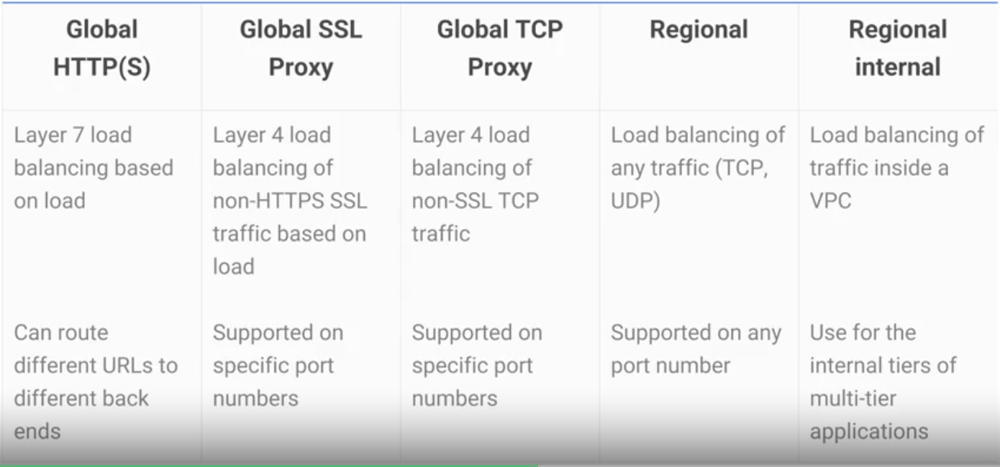
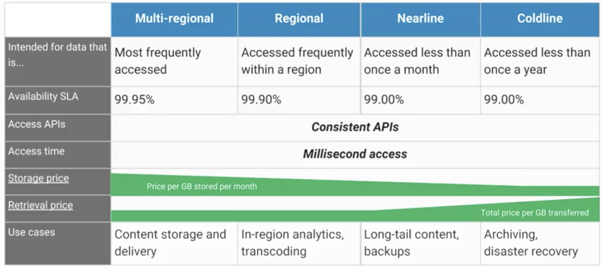
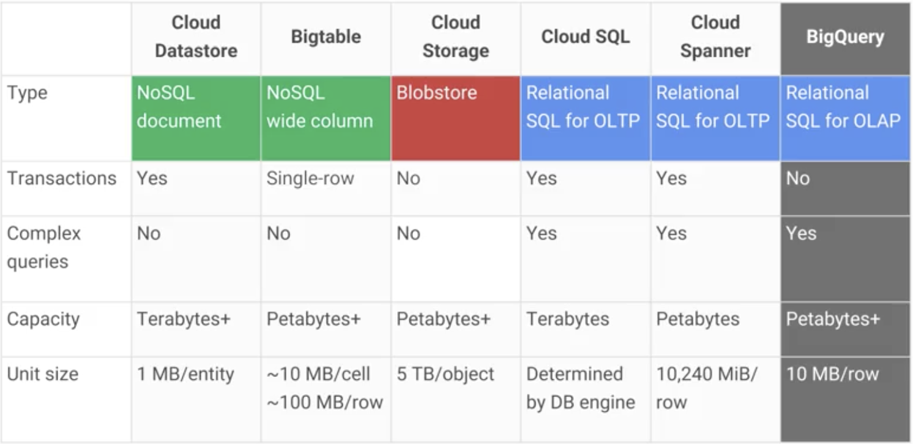
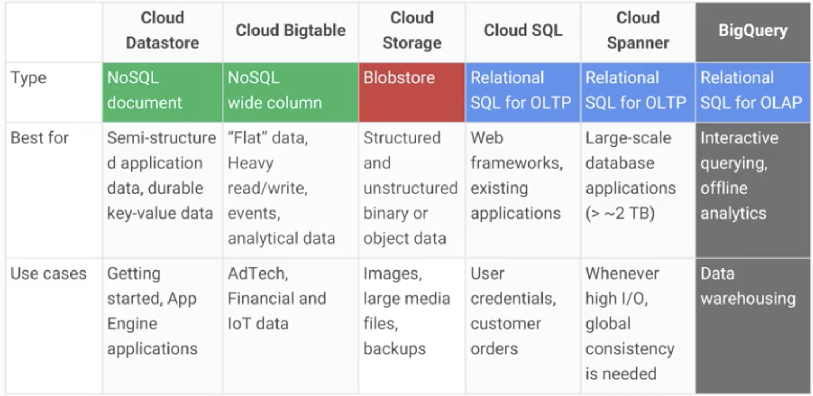
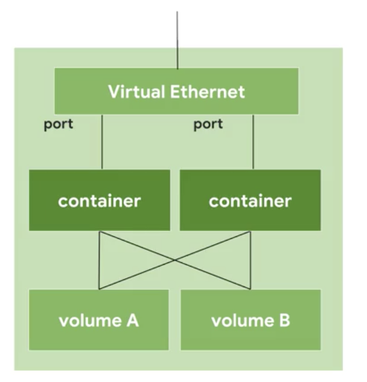

# Google Cloud Platform Fundamentals: Core Infrastructure

## Introducing GCP

### What is cloud computing?

- Is a way of using IT which has these 5 traits:
  - Computing resources on demand and self-serivxe
  - Broad network access - access from anywhere
  - Resources pooling - huge pool of resources and then you are alocated a piece of it
  - Rapid elasticity - if you need more res, you can get more
  - Measured service - pay only what you use or reserve

### How did we get here?

1. You had data centers were each hardware was a full piece
2. Then all the datacenters where on a same place and you would connect to them. (colocation)
3. You virtualized the hardware to separate it into different components
4. Then everything started being used in containers, which would make it easier to make it elastic

### GCP computing architectures

- Google provides different types of services:
  - Infrastructure as a Service SaaS
    - In compute engines
    - You pay what you allocate
  - Hybrid
    - Kubernetes Engines
  - Platform as a Service (PaaS)
    - App Engine
    - bhinds application code into librearies that give access to the infrastructure
    - You pay for what you use

### GCP Regions and zones

- A zone is a deployment area
  - Is kind of a data center
- Zones group into regions which are independent geographical areas
  - Inside regions you got low latency connectivity
  - Under 5 miliseconds
- You can put some resources in a multi-region
  - which makes the resources place in more than 1 region to increase redundancy

### Pricing innovations

- Bills by the second
- When you run more time they give you a discount

### Multilayered security approach

- Servers and networking equipment are custom design by Google
- They design hardware security chips called Titan
- Servers use cryptographic signatures
- Designs and builds its own datacenters incorporating physical security
- The access to the datacenters is restricted
- Encrypted traffic within Google's network

## GCP resource Hierarchy


- Everything is organized into projects
- This projects can be organized into folders and folders inside folders
- All of this can be inside an organization node
- You can put security policies on each of this
- All GCP resources are inside projects
- Inheritance is from top to bottom
- Each resource can only have 1 project
- Each project has a name, ID and unique project number
- EX:
  - Atrato
    - Folder atrato1
      - Project DB
      - Project Node.js
    - Folder Atrato2
      - Project Autonomo
- To use folders you need an organization node
- Organization Policy Administrator
  - Controls everything
- Project Creator:
  - Can create projects
- To get an organization node:
  - You can use google cloud identity to get one
- The policies implemented in higher level can't take away permisions given on the lower level


## IAM

### Identity and Access management

- Lets administratos authorize stuff
- An IAM policy has 3 parts:
  - Who part:
    - tells who this policy is applicable too
    - can be a google account, a group, a service account, an entire gsuite, cloud identity domain
  - can do what part:
    - defined by an IAM role, which is a collection of permisions
    - There are 3 kinds of roles:
      - primitive roles
        - Applied to GCP project and they affect all resources:
          - owner, editor, viewer, billing administrator
      - predefined roles by GCP
        - Can be used in only resources, projects, folders, etc
      - custom roles
        - created by you
  - on which resource:
    - where is the policy going to apply

### IAM Roles

- Compute Engine instant admin role
  - Gives permisions for VMS
  - listing them, reading, changing tehir config, and starting and stopping them
- Costum rote:
  - created by yourself
  - caution:
    - are hard to use
    - can only be used at project and organization levels
- Service accounts:
  - account to authenticate a resources (ex: VMs) ID
  - useful if you want a vm to use a certain other resource but you don't want to give access to only one user
  - They use authenticate keys instead of passwords
  - You can assig IAM roles to it
  - Used to allow apps to manage GCP resources
  - Service accounts are also resources, so you can grant roles to control this accounts
  - You can be used as groups of resources

## Interacting with GCP

4 ways to interact

- Console
  - web based admin interface
  - Lets view and manage all projects and folders
  - Gives access to resources APIs
  - Gives acces to cloud shell
  - From Cloud shell you can use the tools of the SDK
- GCP Software Development Kit (SDK)
  - Set of tools thar you can use to manage the resources and apps on GCP
  - includes:
    - `gcloud` tool
      - main command line interface (CLI) for gcp products and services
    - `gsutil` tool
      - for Google cloud storae and ]
    - bq 
      - for big query
  - Can be accessed on the cloud shell
  - Install it on your own terminal
  - Download the docker image that already has it
- RESTful APIs
  - For applications that you program
  - usually use JSON
  - Enabled through GCP console
  - Most APIs use daily quotas and limits
  - APIs explorer is a tool that helps you to learn the APIs interactively
  - Google provides client libraries to code for APIS
    - Cloud clinet libraries
      - Best one
    - Google API client library 
- GCP mobile app
  - Lets you manage the resources for GCP

## Cloud Marketplace

- Tool for quick deployment of solutions
- Most of them don't have additional charges
- Some have usage fees
- GCP fixes the images software, but it does not once the image is deployed

## Virtual Private Cloud (VPC) Network

- The VPC you define have global scopes
- Inside these networks you can segnment the network into subnets, you can use firewall rules, create static routes to forward traffic
- You can have subnets on any zones
- You can have resources on different zones on the same subnet
- You can increase the IP range of the subnets

## Compute Engine

- Lets create VMs on Google Infrastructure
- No upfront payment
- can run:
  - linux
  - windows
  - custom version
- You can importa images from other servers
- You can use predefined vms or customs
- You can also use GPUs
- You can choose 2 types of persistent storage:
  - Standard
  - SSD
- You can also pick local SSD but it will be cleared once the vm is terminated
- You can choose a boot image, or you can import your own too
- You can define a startup script
- You can take a snapshot of the disk to back up or migrate
- Preemptible VMs:
  - Used for long workload which you are not waiting to see ready, so you can pause the workload and continue without problems
  - This vms are running until there is a another thing that needs the resources, then GCP compute engine has the permission to terminate them to use those resources somewhere else
  - This can save up money
- You can use autoscaling and load balancing to scale your app

## Important VPC Capabilities

- Have routing tables which are built in
- you don't need to manage a firewall instance because google has a global distributed firewalls
  - you can manage rules with tags, ex: all vms tagged web can accept traffic on ports 80 and 443
- VPC belong to GCP projects, but you can do VPC peering between VPCs to exchage traffic
  - But if you want to have full power of IAM to control who can do what on each VPC you can use Shared VPC
- Cloud Load Balancing
  - is a software to manage traffic
  - They are not run in vms so you don't need to scale them becuase GCP does it for you
  - It can be use in any type of traffic
  - It has a single anycast IP whcih connects later to any instance in any region, and does cross-region load balancing
  - The request goes on the google backbone to the closest server which is free
  - Diferent options are used depending your needs:
  - 

- Cloud DNS
  - Create managed zones, then add, edit, delete DNS records
  - Managed DNS service
  - Low latency high availability
- Cloud CDN (content delivery network)
  - Edge caches to cache content close to your users
  - For lower network latency
  - You can use other CDNs with CDN interconnect
- You can have many other type of connections to other networks:
  - VPN
    - IPSec connection
    - Uses cloud router (BGP) to share routes
  - Direct Peering
    - Does not use internet
    - For hybrid cloud workloads
    - Put a router in same public Google data center
  - Carrier Peering
    - If you are not in a google public point of presence you can contact with a partnet in the carrier peering program to connect
    - Downside is that it isn't covered by a Google service level agreement
    - If you want higher uptime you should use dedicated interconnect
  - Dedicated Interconnect
    - You get one or more direct private connections to google
    - This connections are backed up wih a VPN for reliability

## Getting started with compute engine

- To create a vm with the CLI:
  1. Check which zones are available in the area you want
    - `gcloud compute zones list | grep us-central1`
  2. Set the compute zone to the desired one
    - `gcloud config set compute/zone us-central1-c
  3. Create the virtual machine

```
gcloud compute instances create "my-vm-1" \
--machine-type "n1-standard-1" \
--image-project "debian-cloud" \ 
--image "debian-9-stretch-v20170908" \
--subnet "default"
```

## Cloud Storage

- Object storage
  - You tell your storage to save a bunch of bytes under a unique key 
  - Usually keys are in the form of URLs 
  - Good for web technologies
- Its a fully managed scalable service
- You can use it
  - Serve website content
  - storing data for archival and disaster recovery
  - distributing large data objext to end users via direct download
- Not a file system bc each object has a URL
- Not usable for root file system
- Is comprised of buckets you create and configure to hold objects
- Objects are immutable, not able to edit inplace
- All your data is encrypted before it is saved
- Data in transit is encrypted
- When you create a bucket you choose:
  - global unique name
  - geographic location
  - defualt storage class
- Buckets access can be defined with:
  - IAM usaally
  - For finer control with Access control lists (ACLs) that contain:
    - scope
    - permision
- You can turn on the object versioning to keep a history of the files
  - If you are worried about having junk you can have a lifecycle management policies to delete objects. Ex: delete all objects which are 365 days old, only keep the three most recent veersions of each object, etc.

### Cloud storage interactions

- You can choose between 4 classes of storage:
  - Multi-regional
    - high performance
    - it is geo redundant (it stores in 2 geo regions at least)
    - Good for storing frequently accessed data, lik for video games
  - Regional
    - high performance
    - stores all in one region
    - Used mostly to store data close to their compute engines
    - data intensive computations are good with these
  - Nearline
    - archive
    - infrequently accessed data
      - once a month or less
  - Coldline
    - archive
    - low cost
    - online backup
    - Access at most once a year
    - lower availability
    - high per operation cost
- All are accessed with the cloud storage API



- Ways to send data to cloud storage:
  - Online transfer
    - gsutil
    - drag and drop
  - Storage transfer service
    - schedule a batch transfer from another cloud provider or other region or a https endpoint
  - Transfer appliance
    - Ofline solution
      - You lease a rackable appliance and then ship it to google to upload your data
  - Through GCP services
- Usally cloud storage is the long term location of data

## Google Cloud BigTable

- Is a noSQL big data database service
- Fully managed service
- Databases are sparsely populated so that it can scale to billions of rows and thousands of columns, allowing to store up to petabytes of data
- Ideal for data that has a single lookup key
- Can think about it like a persistant hashtable
- High throughput, read and wirte
- Used through HBase API, which makes the portability of applications fast
- Why choose it instead of managing your own
  - Scalable
  - Handles administration tasks
  - All data is encrypted in flight and at rest
  - Control access with IAM
  - used in many google core services
- Can interact:
  - Aplication API
  - Streaming
  - Batch processes

## Google Cloud SQL and Google Cloud Spanner

### Cloud SQL

- Relational Database service
  - Have transactions:
    - either they all happen or none happens
- It offers MySQL or PostgressSQL databases
- capable of handling terabytes of storage
- You can also run your own server with SQL
- Benefits:
  - replicas services:
    - read, failover and external replicas
    - Cloud SQL can replicate data between multiple zones with automatic failover
  - Backsup your data
    - on demand
    - scheduled
  - Scales vertically by changing machine type
  - Scales horizontally via read replicas
  - Network firewalls anc customer data is encrypted
  - Accesible by other GCP services and external services
  - Supports external applications
- You can select on which zone the Cloud SQL will be

### Cloud Spanner

- Offers horizontal scalability with transactional consistency at a global scale and automatic synchronous replication
- Cloud spanner is good for when you outgrown any relational db, need transacional consistency, global data, strong consistency

## Google Cloud Datastore

- Another NoSQL database service
- Main use case:
  - store structured data from App Engine apps
- Automatically handles:
  - sharding
  - replication
- Scales automatically
- Offers transaction that affects multiple database rows
- Lets you do SQL like queries
- Has a free daily quota
- Can span App engine and compute engine applications


## Comparing storage options




- BigQuery is more for big data
  - not for an only application

## Cloud storage practice

- `gsutil` takes care of all the storage services
  - `mb` = make bucket
  - `cp` = copy
  - `acl` = access control list options

## Containers, Kubernetes, and Kubernetes Engine

- Hybrid between compute engine and app engine
- IaaS
  - You virtualize the hardware through virtual machines
  - Each developer can deploy their own OS, access the hardware etc.
  - It gives a lot of freedom on it
  - but as demand increases you need to copy the entire vm, and boot the OS for each app instance, which is slow and costly
- App Engine
  - You get access to programming services
  - Al you do is write code in self contained workloads that use these services and include any dependent library
  - As the demand of your app increases the platform scales you app by workload and infrastructure
  - But you can't tune the underlying architecture to save cost
- Containers give you the independent scalability of workloasds and an abstraction layer of the OS and hardware
- Containers:
  - Only requires few system calls and boots up really fast
  - All you need on each host is an OS krnel that supports containers adn, a container rutnime
  - It scales like PaaS, but gives you almost the whole flexibility of IaaS
  - Code becomes ultraportable because the hardware becomes a blackbox and code works anywhere
  - Ex: You can scale a webserver in seconds by deploying hundreds of containers
  - Usually you won't have all in one single application. You want to do microservices.
    - What you'll do is divide the functions in seperate apps which will then be deployed in containers that are connected in a network of connections and now they can deploy easily and scale independently across a groups of hosts.
    - This hosts can also scale up or down and start or stop container on-demand as demand of applications changes or if a host fail
- Kubernetes:
  - Is the tool that makes it easy to orchestrate many containers on many hosts, scale them as microservices and deploy roll ups and roll backs
  - Is opensource
  - Abstracts containers at a higher level so you can better manage and scale your application
  - At the highest level kubernetes has a set of APIs that you can use to deploy containers on a ser of nodes calles a cluster
  - The system is divideed into a set of master components that run as a control plane and a set of nodes tha run containers
  - A node is a computing instance
  - You can describe a set of applications and how they should interact with each other and Kubernetes figues how to make that happen. 
- Google kubernetes engine (GKE)
  - kubernetes can be configure with many ooptions and add-ons, but this takes a lo of time, so GKE is a solution to it
  - GKE can be customized, they can support diferent vms, nodes, networks
  - You can check the status in the admin console
  - Then you can deploy containers on nodes using a wrapper round one or more container caled a Pod
  - Pod is the smalles unit in kubernetes that you can create or deploy
    - Represent a running process on your cluster 
  - Usually you'll hve one container per pod, but if there are multiple container with a hard dependency you can add wrap them in a single pod
  - Pods share networking and storage


