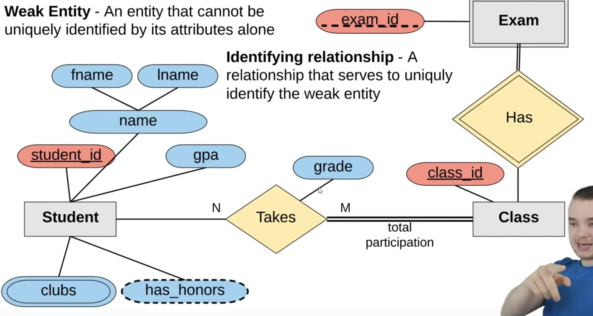
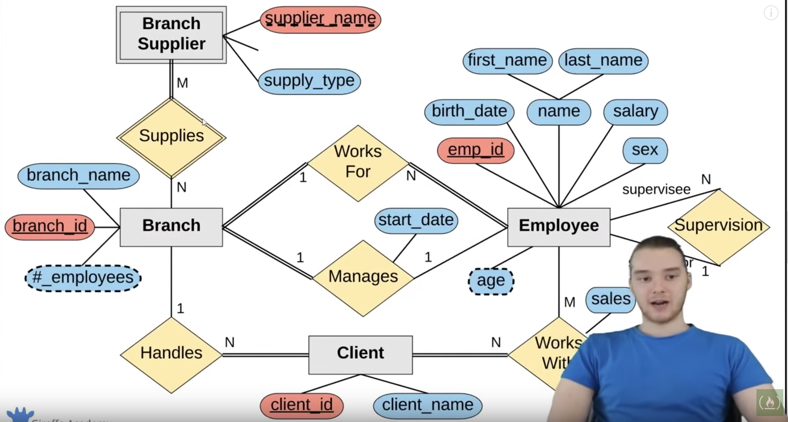
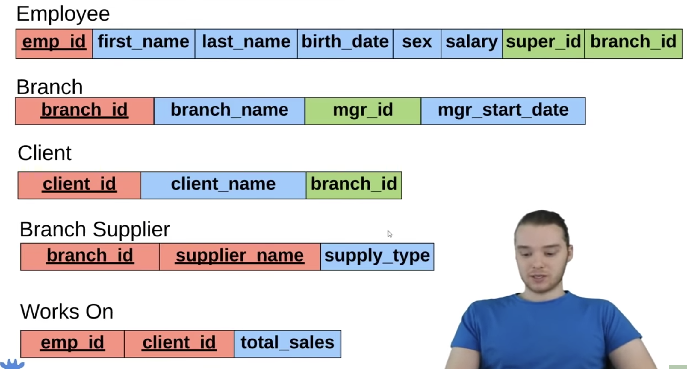
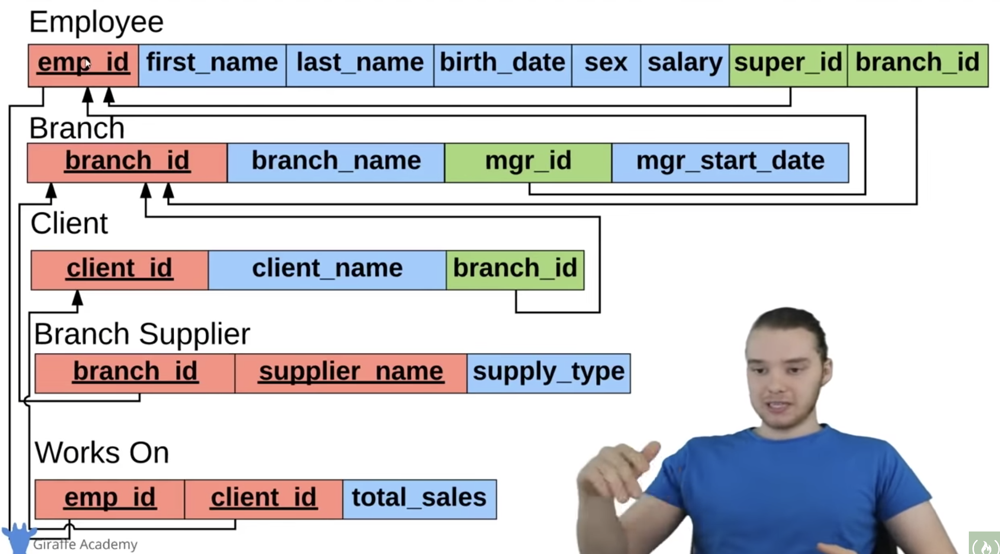

# SQL Dtabases tutorial

## Table of contents

- [SQL Dtabases tutorial](#SQL-Dtabases-tutorial)
  - [Table of contents](#Table-of-contents)
  - [Introduction](#Introduction)
  - [Core Concepts](#Core-Concepts)
  - [SQL Basics](#SQL-Basics)
  - [Installing MySQL](#Installing-MySQL)
  - [Creating a table](#Creating-a-table)
  - [Inserting Data](#Inserting-Data)
  - [Constrains](#Constrains)
  - [Update and Delete](#Update-and-Delete)
  - [Basic Queries](#Basic-Queries)
  - [Creating a complex DB schema](#Creating-a-complex-DB-schema)
  - [SELECT Queries](#SELECT-Queries)
  - [Functions](#Functions)
  - [Wildcards and like keyword](#Wildcards-and-like-keyword)
  - [Union](#Union)
  - [Joins](#Joins)
  - [Nested Query](#Nested-Query)
  - [ON DELETE](#ON-DELETE)
  - [Triggers](#Triggers)
  - [ER Diagram](#ER-Diagram)
  - [Designing an ER Diagram](#Designing-an-ER-Diagram)
  - [Converting ER diagram to DB schema](#Converting-ER-diagram-to-DB-schema)

## Introduction

- Dbs are any collection of related info
- Database Management systems (DBMS) is a software to manage the db
- CRUD = Creat Read Update Delte

## Core Concepts

- All tables have:
  - columns
    - single attributes
  - rows
    - individual entry of for the table
- You always want to have a primary key
  - Attribute which is not repeated
  - Is a unique identifier of rows
  - It can be whatever: string, number, etc.
- Types of keys
  - Segregate key:
    - is a key that has no real meaning in the real world
  - Natural key:
    - a key that has a purpose in the real world
  - Foreign key:
    - attribute that defines the relationships between entries:
      - Can be from the same table or other
    - Is a primary key from same table or another
  - Composite key:
    - key that is made of 2 attributes or more
    - Only together can they identify a single row

## SQL Basics

- Structure Query Language (SQL)
- used for interacting with relational DBMS
- SQL varies between each implementation but they are usually really alike
- Is a hybrid language:
- Data Query Language
  - USed to query
- Data Definition language
  - Used for definning database schemas
- Data Control Language
  - USed for controlling access to the data in the db
  - You can grant users permissions
- Data MAnipulation Language
  - Used for CRUD data from the db
- Queries:
  - is a set of instructions given to the DBMS, that tells the DBMS what do you want to retrieve
  - The goal is to get the data you want

## Installing MySQL

- MySQL is a DBMS to which you connect through the MYSQL server, which is hosted in the local host at the port 3306 by default
- There is a really good program to visualize your db called popsql

## Creating a table

- The first step to do anything is to create the tables
- command:
  - It is not needed to write them in capital letters but it makes it easier to see the query reserved words
  - Example below
```
CREATE TABLE <name> (
	student_id INT PRIMARY KEY,
	name VARCHAR(20),
	major VARCHAR(20)
);

||

CREATE TABLE <name> (
	student_id INT,
	name VARCHAR(20),
	major VARCHAR(20),
	PRIMARY KEY(student_id)
);
```
- Basic datatypes:
  - `INT`
  - `DECIMAL(M, N)` -> *M* is the total number of digits you want to store, *N* is the number of decimal places to store
  - `VARCHAR(l)` -> string of text of length *l*
  - `BLOB` -> Binary large object, store large data. Stands for binary large object
  - `DATE` -> YYYY-MM-DD
  - `TIMESTAMP` -> YYYY-MM-DD HH:MM:SS - used for recording when things happen (like an item was inserted into the db)
  - There are many more
- To see information about a table you'll use:
  - `DESCRIBE <tablename>`
- To delete the table:
  - `DROP TABLE <tablename>`
  - Drop can also remove columns using COLUMN instead of TABLE
- Modify the table:
  - `ALTER TABLE <tablename> OPERATION ...`
    - Example: `ALTER TABLE students ADD gpa DECIMAL(3, 2);`

## Inserting Data

```
INSERT INTO <table> VALUES (<value for column1>, <ValCol2>, ...);
```

- You insert the value into te table, inside the parenthesis you'll need to put them in the order of the columns
- When you don't have a value you can choose what to insert:
  - `INSERT INTO students(student_id, name) VALUES(3, 'claire');`
  - This only inserts values to the first 2 rows of the students table while leaving the next one as NULL
- If you try to insert something with the same primary key then you'll get an error

## Constrains

- You can set constrains to your table to make it easier to fill
- Constrains are set when you are creating the table
- Constrains are set to the columns:
  - `NOT NULL` -> Can't be blank
  - `UNIQUE` -> Can't be repeated
  - `PRIMARY KEY` -> is NOT NULL and UNIQUE
  - `DEFAULT <value>` -> sets a default value for the column
  - `AUTO_INCREMENT` -> can be used so that you get an automatic incremented value
```
CREATE TABLE <name> (
	student_id INT AUTO_INCREMENT,
	name VARCHAR(20) NOT NULL,
	major VARCHAR(20) UNIQUE,
	PRIMARY KEY(student_id)
);
```
## Update and Delete

- How to update and delete info in the table
  - `UPDATE <tablename> SET <column> = <value> WHERE <column> = <value>;`
  - `UPDATE student SET major = 'bio' WHERE major = 'biology';`
- Delete rows:
  - `DELETE FROM <table> WHERE <col> = <value>` 

## Basic Queries

- `SELECT <col>, <col2>` keyword -> tells the DBMS that you want to get info
- A query is a block of SQL which asks the DBMS for information
- Examples:
  - `SELECT *` -> get all
  - `SELECT <col>, <col2>` -> get all entried from columns
  - `SELECT <table>.<column>` -> same as just doing it with column
- All commands shown below can be joined together
- You use conditions to decide what to grab
- `FROM` -> tells the DBMS from which table to grab the info
- `ORDER BY <col>` -> orders the result in ascending order
  - to make it descending just add `DESC`
  - `ORDER BY major, student_id;` -> orders first by  major and then by student ID
- `LIMIT <number>` -> limits the number of results you can get
- `WHERE <condition>` -> filters the results
  - `WHERE major = 'chemistry' OR 'name = 'juan';`
  - Operators:
    - `<`
    - `>`
    - `>=`
    - `<=`
    - `=`
    - `<>` -> NOT EQUAL
    - `AND`
    - `OR`
  - `IN (<val1>, <val2>, <val3>)` keyword -> to select if the value is inside the list
    - `WHERE major IN ('Biology', 'Chemistry')`
- You can use the select command with multiple tables at once

## Creating a complex DB schema

- At the beginning of a complex schema you can't define a foreign key until you have the tables created
  - So you will define a key as foreign until you created the other one
- Defining foreign key at a table creation:
```
CREATE TABLE branch (
  branch_id INT PRIMARY KEY,
  branch_name VARCHAR(40),
  mgr_id INT,
  mgr_start_date DATE,
  FOREIGN KEY (mgr_id) REFERENCES employee(emp_id) ON DELETE SET NULL
);
```
- On delete is explained later
- When you already have a table created and you want to add a foreign key you'll do:
```
ALTER TABLE employee
ADD FOREIGN KEY(branch_id)
REFERENCES branch(branch_id)
ON DELETE SET NULL;
```
- For composite primary keys you'll do:
```
CREATE TABLE works_with (
  emp_id INT,
  client_id INT,
  total_sales INT,
  PRIMARY KEY(emp_id, client_id)
);
```
- When inserting values in complex ids you need to be careful in the orderyou insert the things because you can't insert into a foreign key if the row is not present in the other table
  - In order to do that you'll leave it blank , add to the other table and then update the original one

## SELECT Queries

- Select columns but change their names when you recieve them
  - `SELECT first_name AS forename, lastname AS surname FROM employee;`
    - Selects the columns first_name and lastname and returns them but with the header being forename and surname
- Select all the unique values in the column
  - `SELECT DISTINCT sex FROM employee`
    - Returns the diferent sexes that they are (M, F)

## Functions

- Code that you can code to get info of the data in the tables 
- Find the number of employees
  - `SELECT COUNT(emp_id) FROM employee;`
  - counts how many entries have values
- Find the number of female employees born after 1970
  - `SELECT COUNT (emp_id) FROM employee WHERE sex = 'F' and birth_date > '1971-01-01';`
- find the average of the male employee's salaries
  - `SELECT AVG(salary) FROM employee WHERE sex = 'M';`
- find the sum of all employees salaries
  - `SELECT SUM(salary) FROM employee;`
- Agregation
  - Select how to group your result
  - `SELECT COUNT(sex), sex FROM employee GROUP BY sex;`
  - Returns the count of persons per sex

## Wildcards and like keyword

- Way to define diferent patterns
- `LIKE <pattern>` keyword that is used with wildcards
- Wildcards:
  - `%` -> wildcard for any number of characters
  - `_` -> wildcard for only one character
- ex:
  - `SELECT * FROM branch_supplier WHERE name LIKE '%Label%'`
- Find employees born in october
  - `SELECT * FROM employee WHERE birthdate LIKE '____-10%';`

## Union

- Combine the results of multiple select statements into one
- Find a list of employee and branch name
  - `SELECT first_name FROM employee UNION SELECT branch_name FROM branch`
    - Returns a list of the names followed by the branch names
    - All in one column
- Rules:
  - You need to have the same number of columns in both Select statments
  - Need to have similar datatype
- You can add multiple UNIONs, not just one
  - you can join a lot of selects
- The column name will be tha first select name
  - you can use AS to change it

## Joins

- Combine rows between 2 or more tables based on a related column between them
- Used to combine diferent tables info into one query
- Ex:
  - `SELECT employee.emp_idm employee.first_name, branch.branch_name FROM employee JOIN branch ON employee.emp_id = branch.mgr_id;`
  - Joins together the information based on the employee and the branch id
- If the values don't match then they won't appear on the result
- There are 4 types of joins:
  - Inner join
    - Combines the rows when they have a shared column in common
  - `LEFT JOIN`
    - You get all the results from the left table even if they don't match. It has all the missing values as NULL
  - `RIGHT JOIN`
    - You get all the results from the right table even if they don't match
  - `FULL JOIN`
    - You grab from both
    - NOT AVAILABLE IN MySQL

## Nested Query

- You use multiple select queries
- Ex:
  - Find names of all employees who have sold over 30k to a single client
```
SELECT employee.first_name, employee_last_name
FROM employee
WHERE employee.emp_id IN (
  SELECT works_with.emp_id
  FROM works_with
  WHERE works_with.total_sales > 30000
);
```
- In complicated queries is a good idea to add the table.row notation to keep it readable
- You can use the result of a query in another
- you can use any operator, you just need to add parenthesis to ir
```
SELECT client.client_name
FROM client
WHERE client.branch_id = (
  SELECT branch.branch_id
  FROM branch
  WHERE branch.mgr_id = 102
  LIMIT 1
);

-- This is how you put comments into SQL
-- = only works if there is only one result, that is why you use LIMIT 1
```

## ON DELETE

- Defines what happens when a row is deleted in the table
  - This is important because of foreign keys, if you delete something then the foreign key might not be pointing to anything anymore
- Diferent ways to work
  - `ON DELETE SET NULL`
    - All foreign keys related to the deleted row will be set to null
    - It is okay when the foreign key is not the primary key
  - `ON DELETE CASCADE`
    - All the foreign keys related to the deleted row will be deleted
    - It is okay when the foreign key is also the primary key of the table, because primary key can't be NULL

## Triggers

- Block of SQL code that will define an action that will happen when an operation is done in the db
- Trigger exmaple:
```
DELIMITER $$
CREATE
  TRIGGER my_trigger BEFORE INSERT
  ON employee
  FOR EACH ROW BEGIN
    INSERT INTO trigger_test VALUES ('Added new employee');
  END$$
DELIMITER ;

Does: before any new item is inserted into the employee table for every row you'll insert added new employee falue into the trigger_test table
```
- `DELIMITER`
  - Is what tells the SQL where the SQL command ends, usually it is `;`
  - But when writting triggers you need to use the `;` to end a command inside the trigger so you set a new Delimiter
  - `DELIMITER <newn delimeter>`
  - After doing the trigger you change back to the previous delimiter
```
DELIMITER $$
CREATE
  TRIGGER my_trigger BEFORE INSERT
  ON employee
  FOR EACH ROW BEGIN
    INSERT INTO trigger_test VALUES (NEW.first_name);
  END$$
DELIMITER ;

Does: before any new item is inserted into the employee table for every row you'll inserts the name of the new entry into the trigger_test table
```
- You can use the `NEW` keyword to get values of the new entry
- Example with conditions
```
DELIMITER $$
CREATE
  TRIGGER my_trigger AFTER DELETE
  ON employee
  FOR EACH ROW BEGIN
    IF NEW.sex = 'M' THEN
      INSERT INTO trigger_test VALUES('added male employee');
    ELSE IF NEW.sex = 'F' THEN
      INSERT INTO trigger_test VALUES('added female');
    ELSE
      INSERT INTO trigger_test VALUES('added other');
    ENDIF;
  END$$
DELIMITER ;
```
- To delete a trigger do:
  - `DROP TRIGGER <trigger name>`

## ER Diagram

- Is a way mapout the entities, relationships, etc into a database schema
- **Entity**
  - An object we want to model & store information about
  - ex: student
  - You put it in a square
- **Attributes**
  - Specific pieces of info about an entity
  - ex: name, grade, gpa
  - You put them in ovals
- **Primary keys**
  - Attribute that uniquely identify an etnty in the db
  - ex: student_id
  - You underline it, and put it as a normal attribute
- **Composite attributes**
  - An attribute that can be broken up into sub-attributes
  - ex: name is first name and last name
  - you draw a first oval from the student which is the name and then from name you'll have other 2 ovals for fname and lname
- **Multi-valued attribute**
  - An attribute that can have more than 1 value
  - ex: clubs
  - You draw an oval inside the attribute oval
- **Derived attribute**
  - An attribute that can be derived from the other attributes
  - ex: is_honored_student
  - You put it in an oval with doted line
- **Multiple entities**
  - You can define more than 1 entity on the diagram
- **Relationships**
  - How a entity relates to the other
    - You'll put a  diamond with a verb that relates them
    - ex: student takes class
  - you can have 2 participations:
    - **Partial Participation**
      - Not all the members of the entitiy need to participate
        - ex: not all students need to take a class
      - You use a single line to define the relationship
    - **Total participation**
      - All members must participate in the relationship
      - ex: all classes need to be taken by at least a single student
      - you use a double line to define the relationship
- **Relationship Attribute**
  - An attribute about the relationship
  - ex: the grade of a student in a particular class
  - You put an oval going out of the relationship diamond
- **Relationship Cardinality**
  - The number of instances of an entity from a relation that can be associated with the relation
  - it can be:
    - 1:1 -> one to one
      - a student can take one class and the class can only be taken by one student
    - 1:N -> one to many
      - a student can take one class but the class can be taken by many students or the other way around
    - N:m -> many to many
      - a student can take multiple classes and the classes can be taken by many students
  - You write the ratio on both sides of the relationship diamond
  - Helps to design the db schema
- **Weak entity types**
  - An antity that cannot be uniquely identified by its attribute alone
  - Drawn in a rectangle inside the entity rectangle
  - ex: exam for example can't exist without a class so it is a weak entity
  - It depends on a **Identifying relationship**:
    - A relationship that serves to uniquely identify the weak entity
    - ex: class has an exam
    - It is represented as a diamond inside the relationship diamond
  - The weak entity must always have a total participation
- Examples of ER diagram:




## Designing an ER Diagram

1. You want to create a document with all the data requirement
  - Document which explains all the data that you need for the system and the relationships between the data
  - Written in plain english
2. Go thought the document and find the entities and its attributes(derived). And its primary key
3. Find the relationships (usually looking for verbs)
4. Look for posible weak entities and relationships

## Converting ER diagram to DB schema

1. Mapping of regular entity types
  - For each regular entity type create a table that includes all the simple attributes of that entity
  - Columns are all the attributes
  - Define the primary key
  - With composite attributes you only store the sub attributes
  - You don't add the derived attributes
2. Mapping of Weak Entity Types
  - For each weak entity type create a table that includes all the simple attributes of the weak entity
  - The primary key of the new table should be the partial key of the weak entity plus the primary key of its owner
    - Composite key
3. Mapping of the Binary 1:1  relationship types
  - Binary relationships are relationships which only have 2 entities related
  - Include one side of the relationship as a foreign key in the other.
    - Always favor the total participation, so if you have a total and a partial you'll put the primary key of the partial as the foreign key of the total
    - If both are total or partial then you'll need to see it for yourself
4. Mapping of binary 1:N relationship types
  - Inclue the 1 side's primary key as a foreign key on the N side table
5. Mapping of the Binary M:N relationship types
  - Create a new table who's primary key is a combination of both entitie's primary key's. also include any relationship attributes
   - Compound key: because both primary keys are foreign keys
6. The ER diagram can be more complex and then you'll do more steps but it is rare. It might be like having a triple relationship, but for now that is not needed

---

**ER Starting Diagram**


---

**Resulting tables**



---

**You can also map the relationships with arrows**

