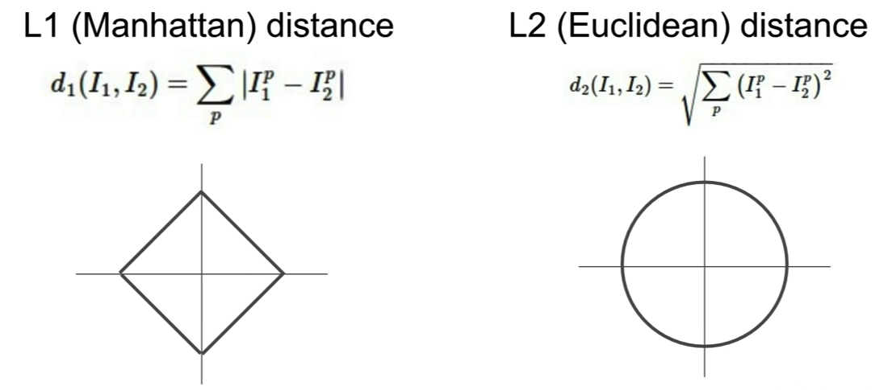
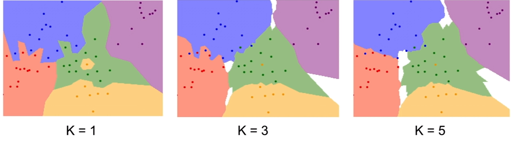
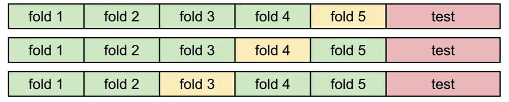
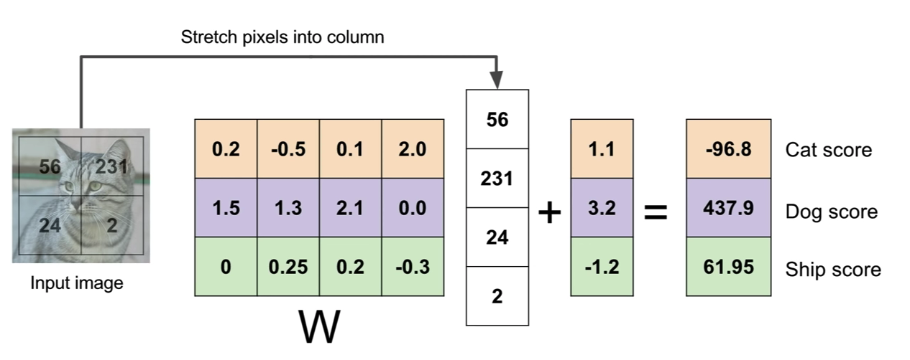
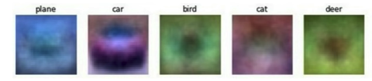
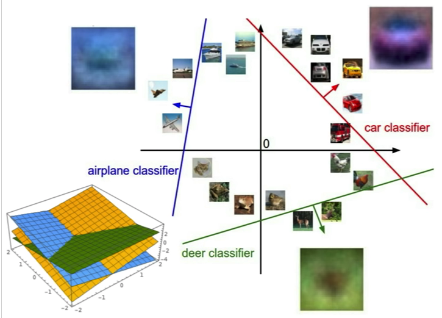
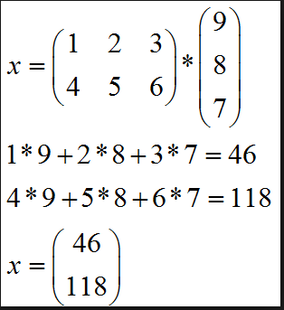
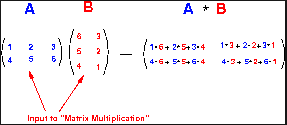

# Lecture 2 | Image Classification

## Image Classification

- Assing fix semantic labels to images
- Images are only a grid of numbers

| 0   | 0   | 0   | 0   |
| --- | --- | --- | --- |
| 256 | 0   | 34  | 0   |
| 0   | 0   | 0   | 0   |

- RGB images are [N x N x 3] arrays

- Challenges:
  - View point
  - Illumination
  - deformation
  - occlusion
    - only part of the object is visible
  - Background clutter
    - object gets lost with the background
  - Intra class variation
    - The same type of objects vary a little bit between each other
      - Ex: Not all cats look the same

- Before engineers would try to make filters to find ways to detect objects, but know they took a data driven approach

### Data Driven Approach
1. Collect Data
2. Use ML to train the classifier
3. Evaluate the classifier in new images

- API gets divided into 2 parts:
	1. Training
	2. Predicting

### Nearest Neighbor
- Data Driven approach
- Trainning:
  - memorize all data
- Prediction:
  - Find the image which is the most similar to the input and use the same label
### Comparison
- How you compare each point against the other

- On L1 if you rotate the image the distance actually changes, while on L2 distance if you rotate the image the distance will still be the same.

### K-Nearest Neighbor
- Usually you use more than one neighbor because it will make your decision more accurate
  - This is called K-Nearest Neighbors algorithm
  - It will smooth out the decision boundaries
  - It will prevent that a outlier of a label could give a wrong guess

**Decision Boundaries**

## Hyperparameters
- Choices about the algorithm that we set instead of making the algorithm learn them
  - K in k-nearest neighbor
  - The loss function

### How to set the hyperparameters
1. Divide your data into 3 sets
  - Training set ~80%
  - Validation set ~10%
  - Testing set ~10%
    - Don't touch until the end
2. **Cross Validation**: Split data into folds and try each fold as a validation and average the results
	- Useful for small datasets but not common in deep learning because trainning is so computational expensive
	- Gold Standardk

### Linear Classifiers
- Deep learning is king of like legos, you put diferent architectures together to build your model
  - Linear classifiers is one of the basic building blocks
- (X) input multiplied by parameters (W) and gives you the predictions
- In parametric approach you sumarize all the information into the parameters
  - makes models more efficient
- Most of deep learning is finiding which function to use
  - The simplest is to multiply them as a linear classifier

- In this example you can see how a linear classifier works
  - The shape of the matric is because you need to have 3 outputs and you have 4 inputs (4 x 3)
	1. Stretch the pixels of the image
	2. multiply by thhe weights
	3. Add the bias
	4. Then you will get the score for that label
- There is a row of wieghts in per each label
- After trainning a linear classifier you can visualize how they learn by reshaping the weights into images again
 

- Linear classifiers can only learn one template by category but other architectures can learn more
- You can think on how linear classifiers work if you see it in space and draw the boundaries

#### Matrix multiplication
- Examples of matrix multiplication to deduct how to do it

