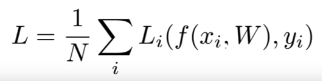
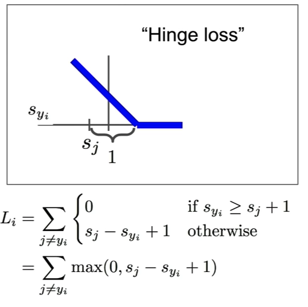

# Lecture 3 | Loss functions and optimization

## Loss Functions
- **Quantifies our unhappiness with the scores across the training data**
- Loss function tells how good is the current classifier
- Loss over the dataset is a sum of loss over the examples
- There are a lot of loss functions

- Explanation of formula
  - N = number of datapoints evaluated
  - Li is the actual loss function
  - yi, is the label
  - f(xi,W) is the prediction result
  - In reality the loss is the average of the losses of all the datapoints evaluated, which is the comparison between the real value and your prediction

### Multiclass SVM Loss "Hinge Loss"
- Loss function that after a threshold the loss is 0

- In this loss function the loss goes down until the point in which it passes the threshold (1 in the picture) and from there on it is 0
  - Sj is your prediction
  - Syi is the real label
  -  +1 is the threshold of this example but it can be other

## Optimization
- Way of efficiently finding the parameters that minimize the loss function